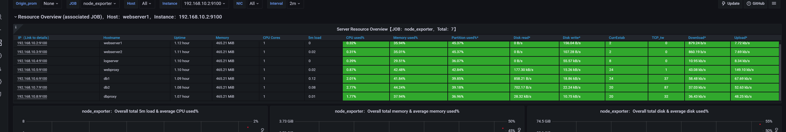
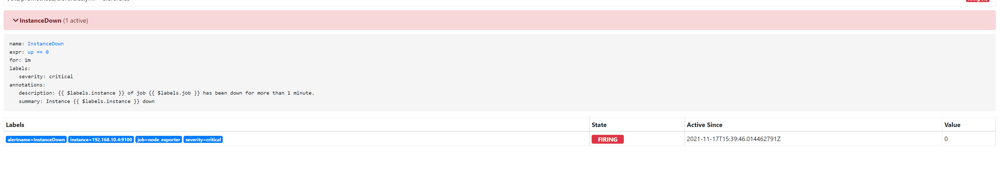

# **Введение**

Итоговый проект для курса "Администратор Linux"


## **Web**

Тестовый сайт доступен из хост-машины http://192.168.9.2
Веб состоит из 3х машин:
* webserver1,webserver1 - Докер контейнер с запущеным проектом https://github.com/NekrasovSt/Agency, запросы проксирует nginx
* webproxy - HAProxy который балансирует нагрузку.

Веб интерфейс балансировки http://192.168.9.2:10001/

## **База данных**

Инфраструктура базы данных построена на основе Postgresql
* db1, db1 - Patroni, Postgresql
* dbproxy - HAProxy который балансирует нагрузку.

Веб интерфейс балансировки http://192.168.9.2:7000/

На все трех машинах установлен etcd в едином кластере.

Проверить статус кластера etcd
```
[root@db1 ~]# etcdctl cluster-health
member 1bba04e768f664ce is healthy: got healthy result from http://192.168.10.8:2379
member 315fd62e577c4037 is healthy: got healthy result from http://192.168.10.7:2379
member f617da66fb9b90ad is healthy: got healthy result from http://192.168.10.6:2379
cluster is healthy

[root@db1 ~]# etcdctl member list
1bba04e768f664ce: name=dbproxy peerURLs=http://192.168.10.8:2380 clientURLs=http://192.168.10.8:2379 isLeader=false
315fd62e577c4037: name=db2 peerURLs=http://192.168.10.7:2380 clientURLs=http://192.168.10.7:2379 isLeader=false
f617da66fb9b90ad: name=db1 peerURLs=http://192.168.10.6:2380 clientURLs=http://192.168.10.6:2379 isLeader=true

```
Проверить статус кластера patroni
```
[root@db1 ~]# patronictl -c /opt/app/patroni/etc/postgresql.yml list
+ Cluster: postgres (7030135220880711238) --+----+-----------+
| Member |     Host     |  Role  |  State   | TL | Lag in MB |
+--------+--------------+--------+----------+----+-----------+
|  db1   | 192.168.10.6 | Leader | running  |  3 |           |
|  db2   | 192.168.10.7 |        | starting |    |   unknown |
+--------+--------------+--------+----------+----+-----------+

```
## **Логирование**

Для логирование используется systemd-journal-remote
Логи собираются со всех машин кроме logserver

```
[root@logserver ~]# ls /var/log/journal/remote
remote-192.168.10.1.journal  remote-192.168.10.2.journal  remote-192.168.10.3.journal  remote-192.168.10.5.journal  remote-192.168.10.6.journal  remote-192.168.10.7.journal  remote-192.168.10.8.journal
```
Просмотр всех сразу
```
[root@logserver ~]# journalctl -D /var/log/journal/remote --follow
-- Logs begin at Mon 2021-11-15 14:12:07 UTC. --
Nov 15 15:10:22 webserver1 systemd[1]: Removed slice User Slice of UID 1000.
Nov 15 15:10:22 webserver1 systemd[1]: run-user-1000.mount: Succeeded.
Nov 15 15:10:22 webserver1 systemd[1]: user-runtime-dir@1000.service: Succeeded.
Nov 15 15:10:22 webserver1 systemd[1]: Stopped /run/user/1000 mount wrapper.
Nov 15 15:10:30 firewall sshd[8045]: Received disconnect from 10.0.2.2 port 52332:11: disconnected by user
Nov 15 15:10:30 firewall sshd[8045]: Disconnected from user vagrant 10.0.2.2 port 52332
Nov 15 15:10:30 firewall sshd[8042]: pam_unix(sshd:session): session closed for user vagrant
Nov 15 15:10:30 firewall systemd[1]: session-8.scope: Succeeded.
Nov 15 15:10:30 firewall systemd-logind[683]: Session 8 logged out. Waiting for processes to exit.
Nov 15 15:10:30 firewall systemd-logind[683]: Removed session 8.
```
Либо по определенной машине
```
[root@logserver ~]# journalctl --file=/var/log/journal/remote/remote-192.168.10.5.journal --follow
-- Logs begin at Mon 2021-11-15 14:14:01 UTC. --
Nov 15 15:10:23 webproxy systemd-logind[711]: Removed session 19.
Nov 15 15:18:01 webproxy anacron[9336]: Job `cron.daily' started
Nov 15 15:18:01 webproxy run-parts[11026]: (/etc/cron.daily) starting logrotate
Nov 15 15:18:01 webproxy run-parts[11031]: (/etc/cron.daily) finished logrotate
Nov 15 15:18:01 webproxy anacron[9336]: Job `cron.daily' terminated
Nov 15 15:18:01 webproxy anacron[9336]: Normal exit (1 job run)
Nov 15 15:25:50 webproxy systemd[1]: Starting dnf makecache...
Nov 15 15:25:50 webproxy dnf[11034]: Metadata cache refreshed recently.
Nov 15 15:25:50 webproxy systemd[1]: dnf-makecache.service: Succeeded.
Nov 15 15:25:50 webproxy systemd[1]: Started dnf makecache.
```
## **Мониторинг**

Мониторинг осуществляется при помощи Prometheus, node_exporter, Grafana
На вссех машинах установлен node_exporter.
На webproxy Prometheus + Grafana
Prometheus: http://192.168.9.2:9090/
Grafana: http://192.168.9.2:3000/ Доступ admin/admin

## **Алертинг**

Для примера настроен алерт недоступна машина более 1 мин.

Для примера можно выключить любую и посмотреть.
http://192.168.9.2:9090/alerts
